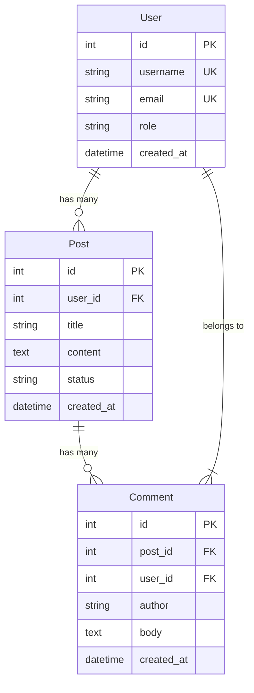
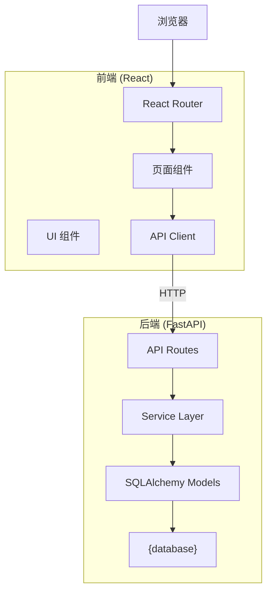

# Documentation Agent Specification v0.1

> 本文档定义 AI Project Factory 的 **Documentation Agent（文档 Agent）**。  
> 在测试通过后执行，自动生成项目的完整文档体系。  
> 这是工厂 ⑦ 号车间的设计规范。

---

## 1. 定位与职责

Documentation Agent 是流水线中在 Test Agent 之后的最后一个生成 Agent：

```
... → Test Agent → Documentation Agent → 最终产物
```

**职责**：基于流水线中积累的全部信息，生成项目的所有文档，包括 README、API 文档、数据库文档和架构图。

**不负责**：代码注释（由各 Agent 在生成代码时完成）。

---

## 2. 输入

Documentation Agent 接收整个流水线的完整产物：

```json
{
  "requirement_spec": { ... },       // RequirementSpec（含 manifest）
  "backend_result": {                // BackendResult
    "files": [...],
    "artifacts": { "openapi_spec": {}, "db_schema": {} },
    "backend_manifest": {...}
  },
  "frontend_result": {               // FrontendResult
    "files": [...],
    "artifacts": { "route_tree": {}, "component_tree": {} },
    "frontend_manifest": {...}
  },
  "test_result": {                   // TestResult
    "report": { "total_tests": 0, "coverage_percent": 0, ... },
    "test_manifest": {...}
  },
  "design_spec": { ... } | null,     // DesignSpec（可选）
  "project_stats": {                 // 从各 Agent 汇总
    "total_files": 0,
    "backend_files": 0,
    "frontend_files": 0,
    "test_files": 0,
    "total_lines": 0,
    "entities_count": 0,
    "endpoints_count": 0,
    "pages_count": 0
  }
}
```

---

## 3. 输出

```json
{
  "status": "success",
  "doc_manifest": {
    "summary": "已生成 5 份文档: README, API 文档, 数据库文档, 架构图, 部署文档",
    "items": [
      {"ref_type": "doc", "status": "completed", "detail": "README.md — 项目总览 + 快速启动"},
      {"ref_type": "doc", "status": "completed", "detail": "API.md — 12 个端点的完整文档"},
      {"ref_type": "doc", "status": "completed", "detail": "DATABASE.md — 2 张表的 ER 图 + 字段说明"},
      {"ref_type": "doc", "status": "completed", "detail": "ARCHITECTURE.md — 系统架构图 + 技术栈"},
      {"ref_type": "doc", "status": "completed", "detail": "DEPLOY.md — Docker Compose + 环境变量"}
    ]
  },
  "files": [
    {
      "path": "README.md",
      "content": "...",
      "type": "doc"
    }
  ]
}
```

---

## 4. 生成的文档类型

### 4.1 README.md（必生成）

**模板结构**：

```markdown
# {project_name}

> {requirement_spec.summary}

## ✨ 功能

- {从 manifest 提取 completed 的功能列表}

## 🚀 快速启动

### 前置要求

- Docker & Docker Compose
- (或) Python 3.11+ + Node.js 20+

### 一键启动

```bash
docker compose up -d
```

### 手动启动

#### 后端

```bash
cd backend
python -m venv venv
source venv/bin/activate  # Windows: venv\Scripts\activate
pip install -r requirements.txt
alembic upgrade head
uvicorn app.main:app --reload
```

#### 前端

```bash
cd frontend
npm install
npm run dev
```

## 📖 API 文档

启动后端后访问: http://localhost:8000/docs

详见 [API.md](./API.md)

## 🗄️ 数据库

详见 [DATABASE.md](./DATABASE.md)

## 🧪 测试

```bash
# 后端测试
cd backend && pytest

# 前端测试
cd frontend && npx vitest run
```

测试覆盖率: {coverage_percent}%

## 🏗️ 技术栈

- **后端**: FastAPI + SQLAlchemy + {database}
- **前端**: React 18 + TypeScript + Vite + Tailwind CSS
- **测试**: pytest + Vitest

## 📁 项目结构

```
{自动生成的文件树}
```

## 📄 许可证

MIT
```

### 4.2 API.md（基于 OpenAPI Spec 生成）

**生成规则**：

```
1. 从 openapi_spec 提取所有 paths
2. 按 tag/entity 分组
3. 每个端点生成：
   - Method + Path
   - 描述
   - 请求参数（Query / Path / Body）
   - 响应格式（200 / 201 / 404 / 422）
   - 示例 curl 命令
```

**模板**：

```markdown
# API 文档

## 基础信息

- Base URL: `http://localhost:8000`
- Content-Type: `application/json`
- Swagger UI: http://localhost:8000/docs

## Users 用户

### GET /users — 分页查询用户列表

**Query Parameters**:

| 参数 | 类型 | 必填 | 默认值 | 说明 |
|---|---|---|---|---|
| page | integer | 否 | 1 | 页码 |
| page_size | integer | 否 | 20 | 每页数量 (最大 100) |
| search | string | 否 | — | 搜索关键词 |
| sort_by | string | 否 | id | 排序字段 |
| sort_order | string | 否 | desc | asc / desc |

**Response (200)**:

```json
{
  "items": [
    {
      "id": 1,
      "username": "admin",
      "email": "admin@example.com",
      "role": "admin",
      "created_at": "2025-01-01T00:00:00Z"
    }
  ],
  "total": 42,
  "page": 1,
  "page_size": 20
}
```

**Example**:

```bash
curl -X GET "http://localhost:8000/users?page=1&page_size=20&search=admin"
```

---

{重复每个端点}
```

### 4.3 DATABASE.md（基于 db_schema 生成）

**模板**：

```markdown
# 数据库文档

## ER 图

```mermaid
erDiagram
    {从 entities + relationships 自动生成 Mermaid ER 图}
```

## 表结构

### users

| 字段 | 类型 | 必填 | 唯一 | 默认值 | 说明 |
|---|---|---|---|---|---|
| id | INTEGER | ✅ | ✅ | AUTO | 主键 |
| username | VARCHAR(50) | ✅ | ✅ | — | 用户名 |
| email | VARCHAR(100) | ✅ | ✅ | — | 邮箱 |
| role | VARCHAR(20) | ✅ | — | 'viewer' | 角色 |
| status | VARCHAR(20) | ✅ | — | 'active' | 状态 |
| created_at | DATETIME | ✅ | — | NOW() | 创建时间 |
| updated_at | DATETIME | ✅ | — | NOW() | 更新时间 |

**索引**:
- `idx_users_username` (username, UNIQUE)
- `idx_users_email` (email, UNIQUE)
- `idx_users_status` (status)

{重复每个表}
```

**Mermaid ER 图生成规则**：

```
输入: RequirementSpec.entities + 它们的 relationships

生成规则:
- 每个 entity → 一个 Mermaid entity 块
- 每个 field → entity 块中的一行，标注类型和 key
- 每个 relationship → 用 ||--o{ 或 }|--|| 连接
```

**示例输出**：



### 4.4 ARCHITECTURE.md（架构图）

**模板**：

```markdown
# 系统架构

## 架构概述

{project_name} 采用前后端分离架构。

## 技术栈

| 层级 | 技术 |
|---|---|
| 后端框架 | FastAPI 0.100+ |
| ORM | SQLAlchemy 2.0 |
| 数据库 | {database} |
| 前端框架 | React 18 + TypeScript |
| 构建工具 | Vite 5 |
| UI 库 | shadcn/ui + Tailwind CSS |
| 状态管理 | TanStack Query |
| 测试 | pytest + Vitest |

## 架构图



## 模块依赖

```
{从 RequirementSpec.entities 生成模块依赖图}
```

## 页面路由

| 路由 | 页面 | 关联实体 |
|---|---|---|
{从 frontend_manifest + RequirementSpec.pages 生成}
```

### 4.5 DEPLOY.md（部署文档）

**模板**：

```markdown
# 部署文档

## 环境要求

- Docker 24+
- Docker Compose v2

## 环境变量

复制 `.env.example` 为 `.env`，修改配置：

| 变量 | 说明 | 默认值 |
|---|---|---|
| DATABASE_URL | 数据库连接串 | sqlite:///./app.db |
| SECRET_KEY | JWT 签名密钥 | (请务必修改) |
| CORS_ORIGINS | 允许的跨域来源 | http://localhost:5173 |

## Docker 部署

```bash
# 构建并启动
docker compose up -d --build

# 查看日志
docker compose logs -f

# 停止
docker compose down
```

## 手动部署

### 后端

```bash
cd backend
pip install -r requirements.txt
alembic upgrade head
uvicorn app.main:app --host 0.0.0.0 --port 8000
```

### 前端（生产构建）

```bash
cd frontend
npm install
npm run build
# 将 dist/ 部署到 Nginx/Caddy
```

## CI/CD（GitHub Actions）

```yaml
{生成 GitHub Actions workflow 文件}
```
```

---

## 5. Documentation Agent Prompt

```
You are a Senior Technical Writer at a software factory. Your job is to generate
complete, accurate documentation for a newly generated project.

---

## INPUT

You will receive:
- requirement_spec: The project's structured requirements (entities, endpoints, pages)
- backend_result: All backend files + OpenAPI spec + database schema
- frontend_result: All frontend files + route tree
- test_result: Test execution report
- design_spec: Design specification (if provided)
- project_stats: Aggregated statistics

---

## YOUR TASK

Generate the following documentation files:

1. **README.md** — Project overview with quick-start instructions
2. **API.md** — Full API reference generated from OpenAPI spec
3. **DATABASE.md** — Database schema with ER diagram (Mermaid)
4. **ARCHITECTURE.md** — System architecture diagram (Mermaid) + tech stack
5. **DEPLOY.md** — Deployment guide with Docker, env vars, CI/CD

---

## CONSTRAINTS

- ALL user-facing text in Chinese (标题、描述、说明)
- Code blocks and technical terms remain in English
- Mermaid diagrams must be syntactically valid
- Use the real data from the input — DO NOT invent examples
- README must reference the user's original requirement summary
- API.md must include curl examples for every endpoint
- DATABASE.md must list all indexes
- DEPLOY.md must include a valid GitHub Actions workflow

---

## OUTPUT FORMAT (CRITICAL)

Output a single JSON object. Each file as a separate entry in the files array.
File contents must be properly JSON-escaped.

Begin your response with: {"status":
```

---

## 6. 与其他 Agent 的关系

```
Backend Agent ──→ openapi_spec ──→ Frontend Agent
       │                              │
       │    ┌─────────────────────────┘
       │    │
       ▼    ▼
   Test Agent
       │
       ▼
 Documentation Agent ← 消费所有上游产物的信息，但不生成新代码
       │
       ├── README.md        ← 从 requirement_spec.summary + project_stats
       ├── API.md           ← 从 backend_result.artifacts.openapi_spec
       ├── DATABASE.md      ← 从 backend_result.artifacts.db_schema + entities
       ├── ARCHITECTURE.md  ← 从 requirement_spec + frontend_result.route_tree
       └── DEPLOY.md        ← 从 generated Dockerfile + docker-compose.yml
```

---

## 7. 文档质量检查

| 检查项 | 方法 |
|---|---|
| 所有链接有效（README 中的 API.md 等） | 正则匹配 markdown 链接 |
| Mermaid 语法可渲染 | Mermaid 解析器校验 |
| API.md 中端点数量 = OpenAPI paths 数量 | 计数比对 |
| DATABASE.md 中表数量 = entities 数量 | 计数比对 |
| curl 示例中的路径匹配实际端点 | 从 OpenAPI spec 提取对比 |
| 部署命令包含在代码中实际生成的 Dockerfile 路径 | 文件路径存在性检查 |
| 无占位符残留（如 TODO, FIXME, {placeholder}） | 正则匹配 |
